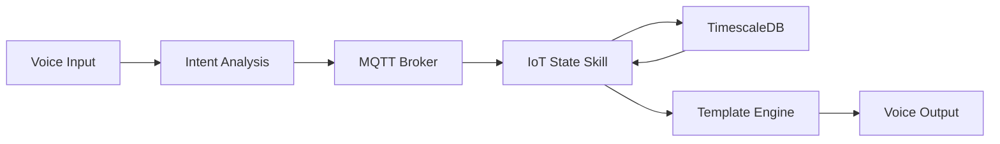

# Private Assistant IoT State Skill

[](https://github.com/copier-org/copier)
[](#)
[](https://github.com/astral-sh/uv)
[](https://github.com/charliermarsh/ruff)
[](https://mypy-lang.org/)
[](https://github.com/psf/black)
[](https://github.com/pre-commit/pre-commit)

A distributed voice assistant skill for querying IoT device states from TimescaleDB. Part of the [private-assistant-commons](https://github.com/stkr22/private-assistant-commons-py) ecosystem.

## Features

- 🏠 **Room-based queries**: Query IoT device states by room
- 🪟 **Window sensor support**: Check if windows are open, closed, or get all states
- 📊 **TimescaleDB integration**: Efficient time-series data queries
- 🤖 **Voice assistant integration**: Natural language processing via MQTT
- 🔄 **Confidence-based skill selection**: Competes with other skills for query handling
- 🐳 **Containerized deployment**: Ready for Kubernetes and Docker environments

## Quick Start

### Prerequisites

- Python 3.12+
- TimescaleDB/PostgreSQL with IoT data
- MQTT broker
- [uv](https://github.com/astral-sh/uv) package manager

### Installation

```bash
# Clone the repository
git clone https://github.com/stkr22/private-assistant-iot-state-skill-py.git
cd private-assistant-iot-state-skill-py

# Install dependencies
uv sync --group dev

# Run the skill
uv run private-assistant-iot-state-skill /path/to/config.toml
```

### Container Deployment

```bash
# Build container
docker build -t private-assistant-iot-state-skill .

# Run with environment variables
docker run -e IOT_POSTGRES_PASSWORD=your_password \
           -e PRIVATE_ASSISTANT_CONFIG_PATH=/config/config.toml \
           -v /path/to/config:/config \
           private-assistant-iot-state-skill
```

## Configuration

Create a configuration file extending the base [SkillConfig](https://github.com/stkr22/private-assistant-commons-py):

```toml
[skill]
client_id = "iot-state-skill"
mqtt_server_host = "localhost"
mqtt_server_port = 1883

[iot]
iot_postgres_user = "postgres"
iot_postgres_db = "iot_data"
iot_postgres_host = "localhost"
iot_postgres_port = 5432
```

### Environment Variables

- `PRIVATE_ASSISTANT_CONFIG_PATH`: Path to configuration file
- `IOT_POSTGRES_PASSWORD`: PostgreSQL password (required)

## Usage Examples

The skill responds to natural language queries about IoT devices:

- "Are there any open windows in the living room?"
- "Show me all window states in the house"
- "Which windows are closed in the bedroom?"

### Supported Device Types

- **Windows**: `window`, `windows` → queries window sensors

### Query Patterns

- **Room filtering**: Queries specific rooms or defaults to request origin room
- **State filtering**:
  - `open` → shows only open devices
  - `closed` → shows only closed devices
  - Default → shows all device states

## Architecture

This skill integrates with the private-assistant-commons framework:

1. **MQTT Communication**: Receives `IntentAnalysisResult` messages
2. **Confidence Calculation**: Competes with other skills (returns 1.0 if device keywords found)
3. **Database Query**: Retrieves latest device states from TimescaleDB
4. **Response Generation**: Uses Jinja2 templates for natural language responses



## Development

### Setup Development Environment

```bash
# Install development dependencies
uv sync --group dev

# Run tests
uv run pytest

# Code quality checks
uv run ruff check --fix .
uv run ruff format .
uv run mypy src/
```

### Project Structure

```
src/private_assistant_iot_state_skill/
├── main.py              # CLI entry point and skill startup
├── iot_state_skill.py   # Core skill implementation
├── config.py            # Configuration models
└── templates/           # Jinja2 response templates
    └── state_query.j2   # State query response template
```

## Database Schema

The skill expects IoT data in the format provided by [mqtt-ingest-pipeline](https://github.com/stkr22/mqtt-ingest-pipeline). Key fields:

- `device_type`: Device type (e.g., "window_sensor")
- `device_name`: Human-readable device name
- `room`: Room identifier (spaces removed)
- `time`: Timestamp for filtering recent data
- `payload`: JSON payload containing device state

## Contributing

1. Follow the coding standards in `AGENTS.md`
2. Add tests for new features
3. Update documentation for API changes
4. Use conventional commits with gitmoji

## License

GNU General Public License v3.0 - see [LICENSE](LICENSE) file.

## Related Projects

- [private-assistant-commons-py](https://github.com/stkr22/private-assistant-commons-py) - Base framework
- [mqtt-ingest-pipeline](https://github.com/stkr22/mqtt-ingest-pipeline) - IoT data ingestion
